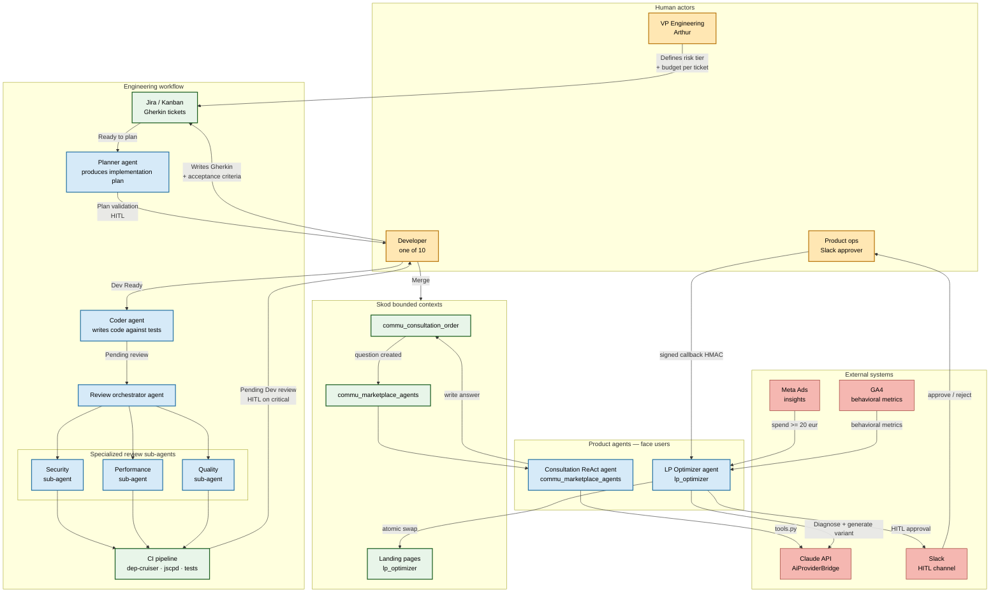

# Skod — AI-Native Operations Architecture

This document describes how Skod operates with autonomous, supervised AI
agents — both for engineering workflows (dev agents) and for product
features (product agents facing end users).

The architecture is deliberately designed for a team of **~10 engineers**
even though the current headcount is smaller, so that every scaling decision
has already been taken when the team grows.

## Principles

1. **Bounded contexts first** — every agent lives inside one bounded context
   and owns a clear slice of the domain (consultation, landing page, marketing).
   No "god agent" that does everything.
2. **Human-in-the-Loop on irreversible actions** — any action that costs
   money, is public-facing, or cannot be cheaply undone requires a human
   one-click validation.
3. **Review the input, not (only) the code** — plans and specs are validated
   upstream by humans; the code produced is a deterministic consequence.
4. **Principle of Least Privilege per agent** — each agent has the smallest
   permission set required. Read-only by default; mutations are explicit.
5. **Audit trail everywhere** — every agent action is logged with attribution
   (which agent, which prompt, which human initiator, which ticket).

## Top-level architecture

## Decision matrix — when to HITL

The authorization level for every agent action is a function of
**reversibility × magnitude of impact**. Concrete rules applied on Skod:

| Action | Reversibility | Magnitude | Control |
|---|---|---|---|
| Agent generates a consultation draft answer | High | Low | Auto — logged only |
| Agent publishes a chat response | Medium | Medium | Auto + rollback (edit later) |
| LP Optimizer generates a landing variant | High (swap back) | Medium | **HITL** Slack approve before activation |
| LP Optimizer auto-deploys a variant | None | High | **Forbidden** (never auto-deploy) |
| Dev agent commits code | High (revert) | Low | Auto + human review on merge |
| Dev agent changes a payment config | None | High | **HITL** + two-person integrity |

## Roles (simulated for a team of ~10)

Even with 1 human currently, each role has explicit scope, responsibilities
and hat. When the team grows, the scope transfers instead of being invented
on the spot.

| Role | Scope | Drives |
|---|---|---|
| **VP Engineering** | Whole system, budget, standards, hiring bar | Risk tiering, KPI targets, ADRs |
| **Tech Lead `commu_consultation_order`** | Consultation bounded context | Gherkin templates, plan-validation gate |
| **Tech Lead `lp_optimizer`** | Landing optimization pipeline | Diagnostic rules, approval workflow |
| **AI Platform Engineer** | MCP servers, prompt library, eval infra | Agent tooling, `AiProviderBridge` |
| **Quality Engineer** | Fitness functions, KPIs, risk tiering | dep-cruiser rules, jscpd thresholds, RCA |
| **Product Ops** | Slack approval of HITL events | LP variant approvals, consultation flags |

## KPIs tracked

- **Rework rate** — % of tickets requiring > 1 iteration before acceptance
- **Code survival rate** — % of AI-generated code still present at 30 days
- **Cost per ticket** — USD consumed via Claude API per merged ticket
- **HITL latency** — time between agent ready-for-review and human decision
- **LP conversion uplift** — CTA click rate variant vs control (the business KPI)
- **Hallucination rate** — PRs rejected for factually wrong content

## See also

- Commit history on branch `feat/ai-native-operations` — enforcement tooling
  (dep-cruiser, jscpd) and MCP server for consultations
- `docs/PLAN_MICROSERVICES.md` — broader microservice vision
- PR #913 — first cross-context implementation of the architecture above
